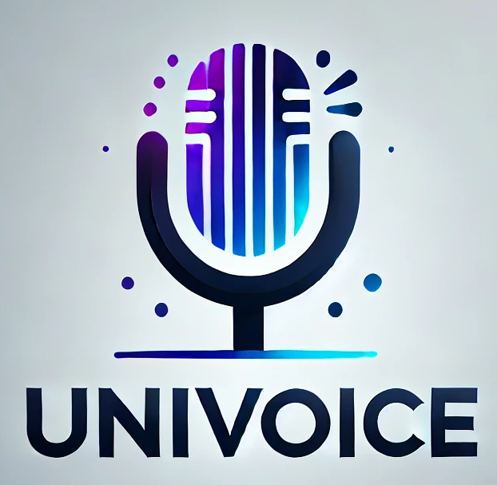

<!-- markdownlint-disable first-line-h1 -->
<!-- markdownlint-disable html -->
<!-- markdownlint-disable no-duplicate-header -->

<div align="center">
<h1>  UniVoice: A Unified Speech Recognition and Synthesis Transformer with Autoregressive and Flow Matching Capabilities</h1>

</div>


<div align="center">

  <a href="https://huggingface.co/guanwenhao/UniVoice" target="_blank">
    
  </a>
  </a>
  <a href="https://huggingface.co/guanwenhao/UniVoice" target="_blank">
    
  </a>

</div>
<div align="center">
  <a href="LICENSE">
    
  </a>
</div>


<p align="center">
  <a href="#2-model-download"><b>Model Download</b></a> |
  <a href="#3-quick-start"><b>Quick Start</b></a> |
  <a href="#4-license"><b>License</b></a> |
  <a href="#5-citation"><b> Citation</b></a> <br>
  📄 Paper Link (<a href="https://arxiv.org/abs/"><b>UniVoice</b></a>)
</p>


## News

**🚀 2025.03.30**: The inference codes and checkpoints are released!


## 1. Introduction

This work introduces UniVoice, a novel approach that integrates autoregression and flow matching within a transformer-based framework for speech unified understanding and generation. 
UniVoice is designed to achieve both speech comprehension and generation capabilities through a unified model trained in a single stage. Our experiments demonstrate that UniVoice 
delivers strong performance for both automatic speech recognition and zero-shot speech synthesis tasks. By combining autoregression and flow matching, UniVoice establishes a foundation
for expanding to additional audio understanding and generation tasks using the paradigm in the future.

In this work, we use [SmolLM2-360M-Instruct](https://huggingface.co/HuggingFaceTB/SmolLM2-360M-Instruct) as the LLM backbone.


## 👨‍💻 Todo
- [x] Release UniVoice inference code 
- [x] Release UniVoice checkpoints
- [ ] UniVoice paper and demo
- [ ] Release UniVoice training code


## 2. Model Download

### Huggingface

| Model                  | Download                                                                    |
|----------------------|-----------------------------------------------------------------------------|
| UniVoice-ASR | [🤗 Hugging Face](https://huggingface.co/guanwenhao/UniVoice/tree/main/univoice_asr) |
| UniVoice-TTS | [🤗 Hugging Face](https://huggingface.co/guanwenhao/UniVoice/tree/main/univoice_tts) |
| UniVoice-All | [🤗 Hugging Face](https://huggingface.co/guanwenhao/UniVoice/tree/main/univoice_all) |

NOTE: We now only trained a model on a 960hs LibriSpeech datatset, We will release a model trained with more data in the future.

## 3. Quick Start
### Installation

On the basis of `Python >= 3.9` environment, install the necessary dependencies by running the following command:

```shell
git clone https://github.com/gwh22/UniVoice
cd UniVoice
# We recommend using conda to create a new environment.
conda create -n UniVoice python=3.9
conda activate UniVoice
# install cuda >= 11.8
conda install cudatoolkit=11.8 -c nvidia

pip install -r requirements.txt
```

### Inference
```shell
cd UniVoice
# for ASR task
sh scripts/univoice/infer_asr.sh
# for TTS task
sh scripts/univoice/infer_tts.sh
```


## 4. License

This code repository is licensed under [the MIT License](https://github.com/gwh22/UniVoice/blob/main/LICENSE)

<!-- ## 5. Citation

```bibtex

``` -->

## 5. Acknowledgments

This codebase borrows from [DiT](https://github.com/facebookresearch/DiT), [SmolLM2-360M-Instruct](https://huggingface.co/HuggingFaceTB/SmolLM2-360M-Instruct), [Monoformer](https://github.com/MonoFormer/MonoFormer), [LLaVA](https://github.com/haotian-liu/LLaVA), and [Transformers](https://github.com/huggingface/transformers). Thanks for their great works.


